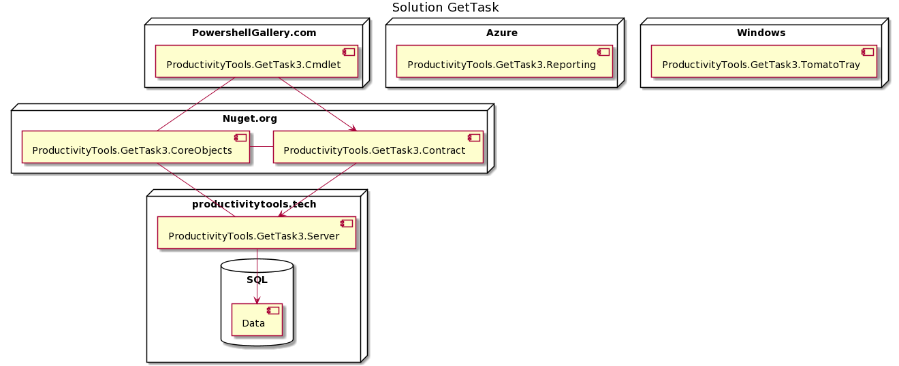
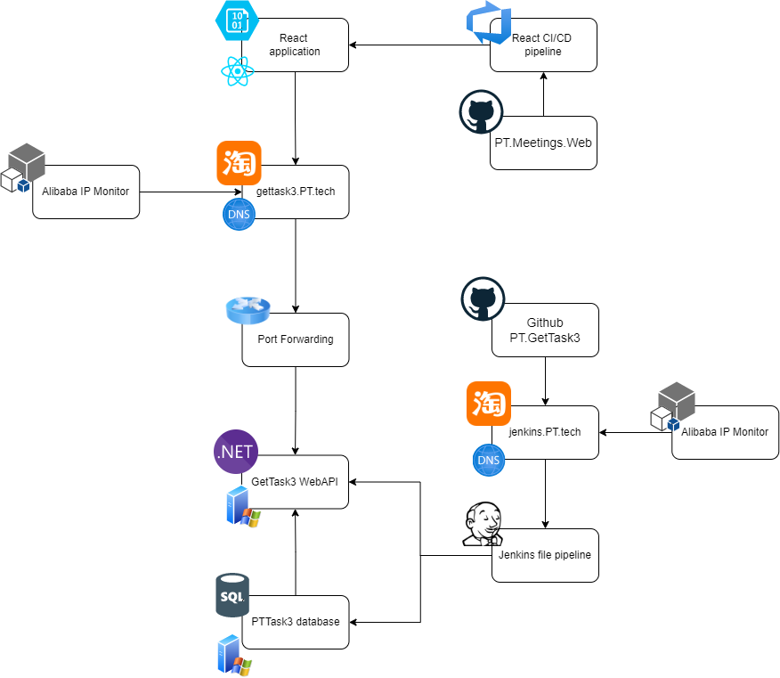

Task3 application is 3rd version of the task application. It is simple tool which allows to keep tasks in the hierachical structure

# Projects

# Task3 solution architecture

## Physical architecture

- **React application** is stored as static web on the Azure Storage
- **Alibaba IP Monitor**  WebApi is hosted on my local server where I do not have static ip. So Alibaba IP monitor checks if my external IP changed and update DNS. Domain is parked on the Alibaba
- **GetTask3 WebApi** is written in the .NET and it is hosted on my server
- **PTTask3 database** is SQL and it is hosted on my server
- **Jenkins file pipeline** CI/CD on the server side is done with the Jenkins
- **Github PT.GetTask3** is repository for webapi. When push to repository is done, push to the jenkins webhook **jenkis.PT.Tech** is done
- **Jenkins.PT.Tech** - address where all webhooks from github are sent. From here Jenkins catches them and invoke his actions.

